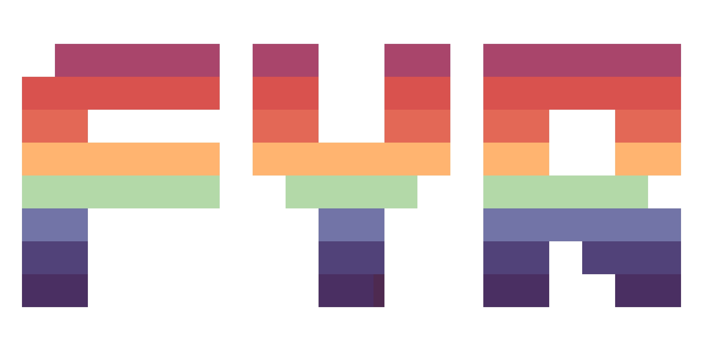

<p align="center"><p>
<p align="center"><a href="./docs/">Docs</a> | <a href="./src/demo/">Demo Project</a></p>

**fyr** is a wrapper of [Not-Nik](https://github.com/Not-Nik)'s [raylib-zig](https://github.com/Not-Nik/raylib-zig) using [johan0A](https://github.com/johan0A)'s [clay-zig-bindings](https://github.com/johan0A/clay-zig-bindings). **fyr** also contains a fully functional ECS (Entity Component System) and a caching asset handling solution.

> [!IMPORTANT]
> This project is still very much under development! Contributions are welcome. <br>
> The project uses zig version `0.14.0` and the latest version of the bindings.

## Add the `fyr` library

You are only a couple of easy steps away fromm building your dream project:

1. Run the following command to save the dependency:
   ```bash
   zig fetch --save git+https://github.com/zewenn/fyr#stable
   ```
2. Add the following to your `build.zig`:

   ```zig
   const fyr_module = b.dependency("fyr", .{
       .target = target,
       .optimize = optimize,
   });

   const fyr = fyr_module.module("fyr");

   exe.root_module.addImport("fyr", fyr);
   ```

3. You are ready to go! Now you can import fyr with a regular zig `@import()`:
   ```zig
   const fyr = @import("fyr");
   ```

## Project Setup

Setting up a project with `fyr` is so easy, even your grandma could do it :smile:

> [!NOTE]
> You can follow the documentation, or take a look at the [demo project](./src/demo/main.zig)

```zig
const window = fyr.window;

pub fn main() !void {
    fyr.project({
        window.title("fyr-demo");
        window.size.set(fyr.Vec2(1280, 720));
        window.fps.setTarget(256);
        window.resizing.enable();

        // Paths for the assets directory
        fyr.useAssetPaths(.{
            .debug = "./src/demo/assets/",
        });
    })({
        // The default scene will be automatically loaded.
        fyr.scene("default")({
            fyr.entities(.{
                // Add entities here
            });

            fyr.scripts(.{
                // Add scripts here
            });
        });
    });
}
```
