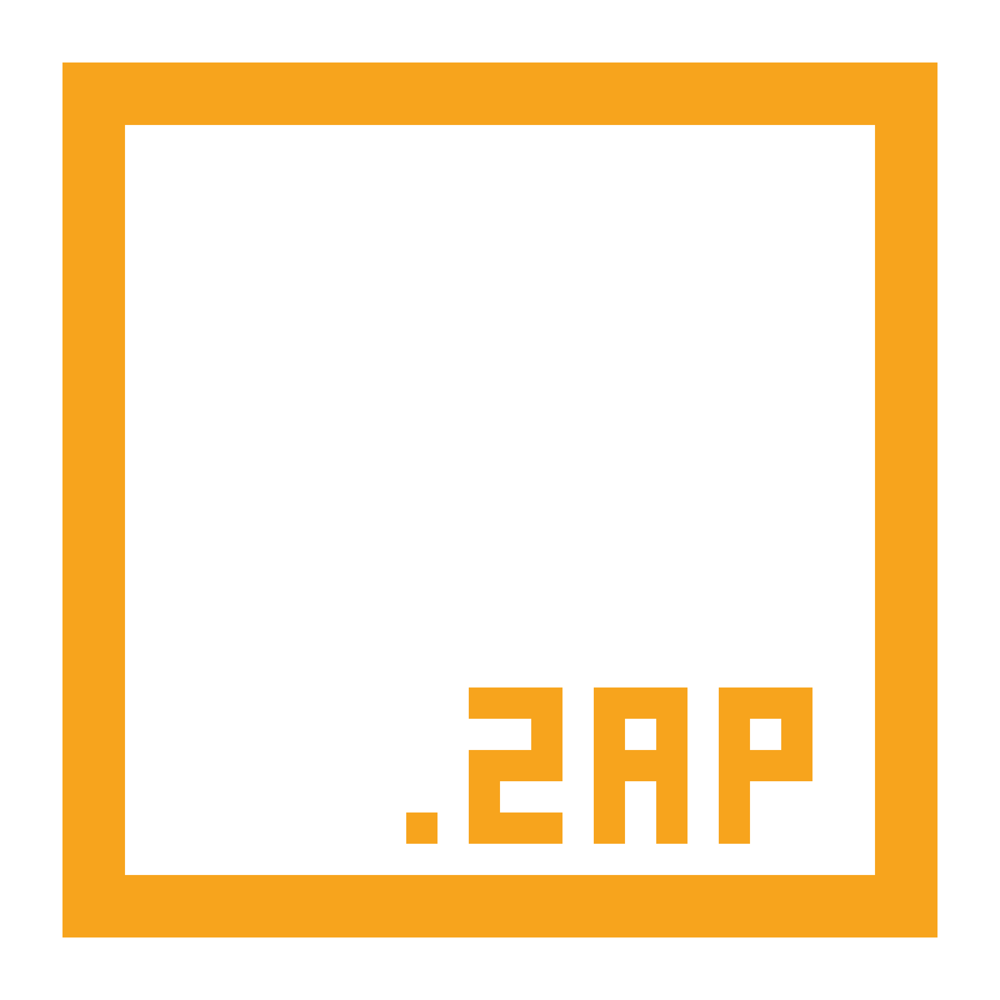

### **zap**

zap is a custom **zig-based** wrapper of [Not-Nik](https://github.com/Not-Nik)'s [raylib-zig](https://github.com/Not-Nik/raylib-zig); containing an entity component system, asset loading, automatic rendering and many more features...

**NOTE: This project is still very much under development, take care when using! Contributions are welcome.**

