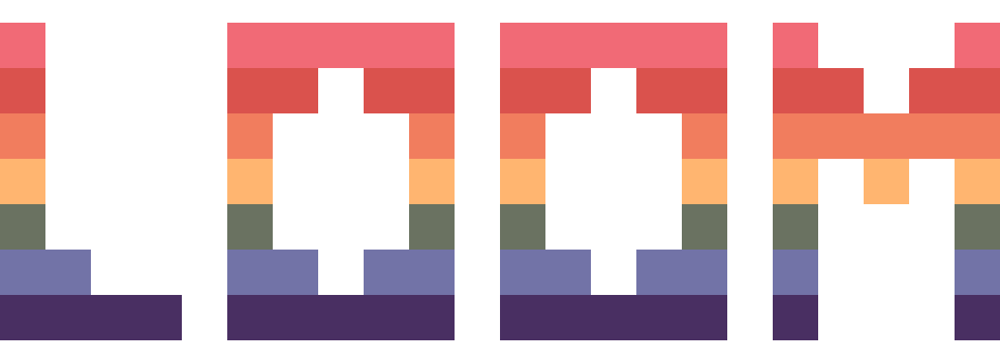

# loom

**loom** is our in-house engine wrapping [Not-Nik](https://github.com/Not-Nik)'s [raylib-zig](https://github.com/Not-Nik/raylib-zig) and using [johan0A](https://github.com/johan0A)'s [clay-zig-bindings](https://github.com/johan0A/clay-zig-bindings) for UI.

> [!important]
> This project uses zig version `0.14.0` and the latest version of the bindings.

The engine aims to provide a declarative interface for game development. We try to provide code only Unity, where you only have to configure the scenes and entities with a few lines of code, so you can have more time for the actual game dev.
